

# AutoBerryPicker

**An autonomous, low-cost robotic arm that optically detects and picks strawberries, built as a VCE Systems Engineering Unit 3 & 4 folio project.**

Xavier Phillips, Viewbank College

  

   

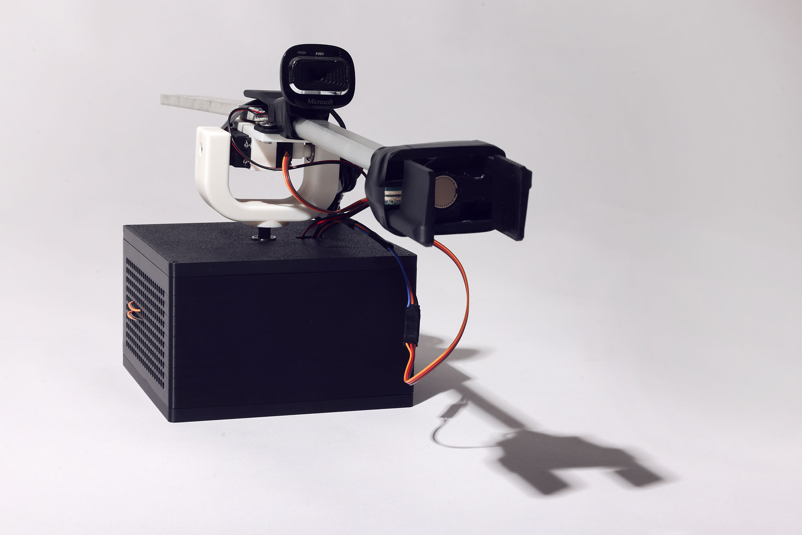
_The completed AutoBerryPicker device. Top Designs 2026 / Source: Courtesy of the Victorian Curriculum and Assessment Authority. / Photo: Nicole Cleary_

---

## Contents

- [Overview](#overview)
- [Project Snapshot](#project-snapshot)
- [Technical Skills](#technical-skills)
- [Design Brief](#design-brief)
- [Design Process](#design-process)
- [Planning](#planning)
- [Development Log](#development-log)
- [Testing & Results](#testing--results)
- [Evaluation & Improvements](#evaluation--improvements)
- [Reflection](#reflection)
- [Gallery](#gallery)
- [Documentation](#documentation)
- [Acknowledgements & License](#acknowledgements--license)

---

## Overview

I built this robotic arm for my VCE Systems Engineering project to explore automation in agriculture, inspired by the United Nations' Sustainable Development Goal (SDG) #8: "Decent Work and Economic Growth". Specifically, Target 8.7 aims to eradicate forced labour and end modern slavery, including child labour.

[Statistics indicate](https://www.dol.gov/agencies/ilab/resources/reports/child-labor/findings) that the most common industry exploiting child and forced labour is the agricultural sector, where laborers are often used to pick small crops like cotton and berries.

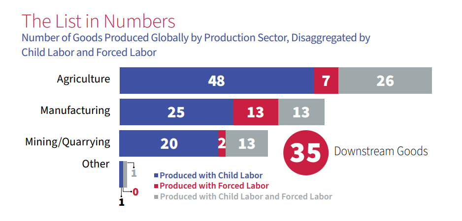
_Proportion of goods produced by children and forced labour by industry._

The issue can be alleviated by implementing automated robotic arms in farming areas. By creating an affordable robotic arm that can optically detect crops and carefully remove them from plants, such devices could replace children and forced labourers without reducing crop yield or efficiency. Food wastage may also be reduced by reducing the amount of bruised or damaged crops due to mishandling, thus supporting the UN's SDG 12.

The project design process utilised CAD software (Onshape) to precisely design components, fabricated with 3D printing additive manufacturing technology. The electromechanical system features an optical camera sensor and a custom program to identify strawberries in real-time and record their position; a microcontroller and motor controller relay this position to a robotic arm, which moves to the strawberry and precisely grips and removes the crop from the plant.

The project focuses on picking strawberries specifically, as they are fragile berries that can be used to demonstrate the robotic arm's ability to pick delicate crops precisely, without bruising them. If the device is capable of picking strawberries, it can be easily adapted to pick other crops, such as other types of berries or even cotton.

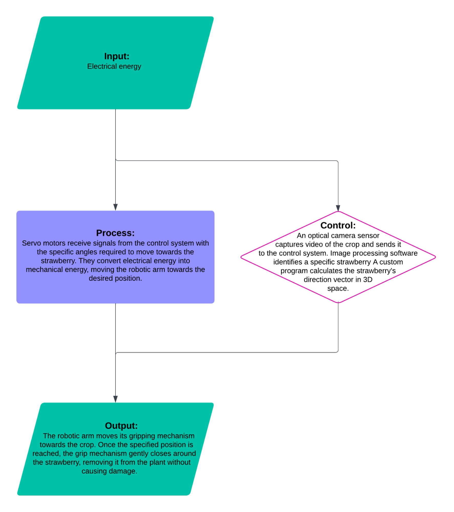
_IPO diagram of the features of the AutoBerryPicker device._

<strong>Glossary</strong>

| Term       | Meaning                                                                                                   |
| ---------- | --------------------------------------------------------------------------------------------------------- |
| **Device** | The complete, functioning electromechanical system                                                        |
| **User**   | An individual or organisation implementing the device in a farm, workplace, or other agricultural setting |
| **FSR**    | Force-sensing resistor                                                                                    |

---

## Project Snapshot

### Details

|                   |                                                                                    |
| ----------------- | ---------------------------------------------------------------------------------- |
| **Course**        | VCAA Systems Engineering, Units 3 & 4 (2025)                                       |
| **Institution**   | Viewbank College                                                                   |
| **Developer**     | Xavier Phillips                                                                    |
| **Timeline**      | 15-week development cycle                                                          |
| **Budget**        | \$150 AUD                                                                          |
| **Final Score**   | 29/40 (73%)                                                                        |
| **Core stack**    | Onshape (CAD); Arduino IDE; Python (OpenCV, NumPy); Raspberry Pi 3; Arduino Uno R3 |
| **Manufacturing** | FDM 3D printing (Bambu Lab P1S / X1C); CNC laser engraving                         |

### Specifications

| Spec                            | Value                               |
| ------------------------------- | ----------------------------------- |
| Degrees of freedom              | 3 (polar/spherical configuration)   |
| Power supply                    | 12V DC (battery or mains-rectified) |
| Max. power draw (theoretical)   | 41.2 W                              |
| Weight (excl. power source)     | 1081.4 g measured (976 g expected)  |
| Strawberry recognition accuracy | 0% false positives (16 trials)      |
| Measured picking rate           | 2.1 picks/min                       |
| Measured arm movement time      | 2.07 s ± 0.13 s                     |

---

## Technical Skills

| Area                 | Skills and tools                                                                                |
| -------------------- | ----------------------------------------------------------------------------------------------- |
| Mechanical design    | CAD modelling and mechanical design in Onshape                                                  |
| Embedded systems     | Arduino Uno R3, Arduino IDE, embedded programming                                               |
| Computer vision      | Python, OpenCV, NumPy, real-time strawberry detection                                           |
| Digital fabrication  | FDM 3D printing, CNC laser engraving                                                            |
| Electronics          | Circuit design, power and current calculations, soldering, wiring, heat-shrink insulation       |
| Testing and analysis | Diagnostic testing, statistical analysis, confidence intervals, two-tailed significance testing |
| Project management   | Risk assessment, OH&S documentation, Gantt charts, timeline planning                            |
| Documentation        | Technical documentation and evidence-based design evaluation                                    |

Technical details

- Designed and modelled mechanical components using Onshape CAD.
- Programmed an Arduino Uno R3 using the Arduino IDE for embedded system control.
- Developed a computer vision system using Python, OpenCV, and NumPy for real-time strawberry detection.
- Manufactured prototypes using FDM 3D printing (Bambu Lab P1S and X1C) and CNC laser engraving.
- Designed and assembled electronic circuits, including power and current calculations, soldering, wiring, and heat-shrink insulation.
- Developed diagnostic tests and analysed results using statistical methods, including confidence intervals and two-tailed significance testing.
- Managed project planning through risk assessments, OH&S documentation, Gantt charts, and timeline tracking.
- Produced technical documentation and evaluated the final design using evidence-based analysis.

---

## Design Brief

The project's goal, an affordable electromechanical system to reduce worldwide reliance on unethical labour practices for crop harvesting, was governed by a strict set of constraints:

| Constraint                                                      | Why It Matters                                                                                                                                                                                         |
| --------------------------------------------------------------- | ------------------------------------------------------------------------------------------------------------------------------------------------------------------------------------------------------ |
| Budget limited to **$150**                                      | Ensures the device is affordable, as the cost of the final product influences its potential as a valid replacement for child labour and forced labour in the agriculture industry                      |
| Single developer                                                | Limits complexity; simplicity must be prioritised to ensure realistic completion                                                                                                                       |
| **12V DC** power supply or battery                              | Ensures flexibility in where and how the device is used                                                                                                                                                |
| Weight (excl. power source) **< 5 kg**                          | Ensures portability and compatibility with many mounting systems, including moving vehicles                                                                                                            |
| Pick **≥ 5 strawberries/minute**                                | Based on the average weight of [12-15kg of strawberries picked per hour by workers](https://wikifarmer.com/); assuming 4 robots replace 1 human worker, a required picking rate of 5 per minute was determined |
| Max power draw of **24 watts**                                  | Improves compatibility with mobile power sources such as a common 12V 2A portable battery                                                                                                              |
| No safety risk to nearby individuals, users, or the environment | All moving parts and circuits must be enclosed to prevent accidental injuries from the mechanism or electrical shock                                                                                   |

<strong>Full arm, control system & grip mechanism requirements</strong>

**The robotic arm must:**

- Have three degrees of freedom, allowing it to move to any position in 3D space within a predetermined spherical radius while its base is in a fixed position
- Have a spherical range radius large enough to reach more than one plant without moving the base
- Have motors with sufficient torque to support the mechanism itself, and any additional load exerted when picking the crops
- Have motors with an appropriate RPM and acceleration to allow the picking of several strawberries per minute
- Have a base which can be secured easily with bolts or screws, allowing it to be mounted wherever the user desires
- Have a sturdy construction using a light material, and a full plastic shell to enclose wiring

**The control system must:**

- Have the capability to recognise strawberries in real-time
- Be able to extrapolate or estimate the relative position of a strawberry in 3D space based on a video camera feed and other sensors, in real-time
- Be able to calculate the angles of the servo motors to reach the desired 3D position to pick a strawberry, in real time
- Be compatible with open-source platforms such as Arduino IDE and Python

**The grip mechanism must:**

- Be able to evenly apply force to remove a strawberry from a strawberry plant without any bruising
- Be able to remove strawberries from strawberry plants, using as much force as required

<strong>Design considerations explored</strong>

- Increasing battery life using renewable energy sources like solar panels, adhering to Cradle to Cradle (C2C) standards
- Sustainably sourced materials that adhere to C2C standards
- The ability to manually select which crop the device should pick
- A trough for depositing picked crops into, separated based on crop type
- A secondary grip mechanism to hold onto the stalk while the crop is picked
- A modular belt conveyor system to transport harvested materials to an industrial storage area
- Wheels or tracks to provide an additional two degrees of freedom
- Remote monitoring and control via radio signals, Bluetooth, or Wi-Fi
- Regenerative braking circuits for the servo motors to reduce net energy consumption
- A user-friendly web or mobile interface for configuration of settings
- Easily accessible and replaceable internal/external components, requiring no specialised tools
- A manual or set of guidelines to help users operate the device

---

## Design Process

### Benchmarking Against Similar Products

| Product                                                                                 | Similarities                                                                                                                                                                | Differences                                                                                                                                                             |
| --------------------------------------------------------------------------------------- | --------------------------------------------------------------------------------------------------------------------------------------------------------------------------- | ----------------------------------------------------------------------------------------------------------------------------------------------------------------------- |
| Large robotic arm for vertical commercial strawberry farms (StrawberryPlants.org, 2023) | Articulated robotic arm; 2-finger robotic grip; only picks ripe crops; picks crops from a bottom-up angle                                                                   | Optimised for vertical farms; primarily metal-based; moves autonomously using wheels; linear movement to pick crops                                                     |
| Large fixed robotic arm for cotton picking (Green Robot Machinery, 2022)                | Optimised for traditional farms                                                                                                                                             | Spherical robotic arm; only picks cotton using a vacuum; primarily metal-based; fixed base; picks from a top-down angle                                                 |
| Automatic strawberry picker (Octinion, 2017)                                            | Articulated robotic arm; 2-finger robotic grip; only picks ripe crops; uses rotational movement; grips using a large surface area (cupped grip); picks from bottom-up angle | Optimised for vertical farms; automatically sorts bruised/diseased crops; primarily metal-based; moves autonomously using wheels                                        |
| Cotton-harvesting autonomous platform (Maja et al., 2021)                               | Optimised for traditional farms; 2-finger robotic grip; uses linear movement                                                                                                | Cartesian robotic arm; only picks cotton; primarily metal-based; moves autonomously using wheels; picks from top-down angle; relies on pre-programmed map route and GPS |

_Overall summary of observations from research of various similar products._

The Octinion strawberry picker brought useful inspiration for how to carefully remove delicate crops from plants without bruising or damaging the crop. The device uses a rotating motion to remove strawberries and hold them in a cup-shaped holder, and the large surface area of the holder minimises pressure on the strawberry, reducing the risk of bruising and damage.

### Robotic Arm Type Selection

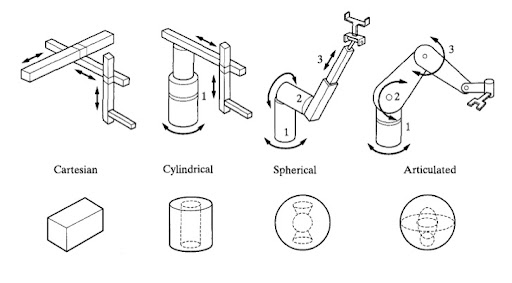
_Illustration of the 4 main robot types that were evaluated._

| Type                        | Verdict                                                                                                                                                     |
| --------------------------- | ----------------------------------------------------------------------------------------------------------------------------------------------------------- |
| Cartesian Robot             | Offers high precision and rapid acceleration but lacks range, requiring far more materials and larger size; deemed unsuitable                               |
| Cylindrical Robot           | Simple coordinate system and construction, cheap and easy to program, but lacks flexibility for delicate, organic shapes; deemed unsuitable                 |
| **Polar (Spherical) Robot** | Uses a rotary actuator for elevation and a single linear actuator as the final degree of freedom that extends and retracts. **Selected.**                   |
| Articulated Robot           | Can approach a point from various angles and navigate hard-to-reach areas, but requires more complex 3D position determination; considered but not selected |

> **Selected design rationale:** the polar robot approach was selected, as it offers sufficient range and flexibility while having a lower cost, software complexity, and hardware complexity. The control subsystem maps each camera pixel to a direction vector, and the device aligns itself in the rotational (base) axis and the elevational axis to point towards a direction vector at the centre of a crop. The radial (extension) axis extends using a linear actuator until it reaches a crop, using a button or touch sensor to detect contact. Once reached, the grip mechanism performs a grip action, and the radial axis retracts, removing the crop from the plant.

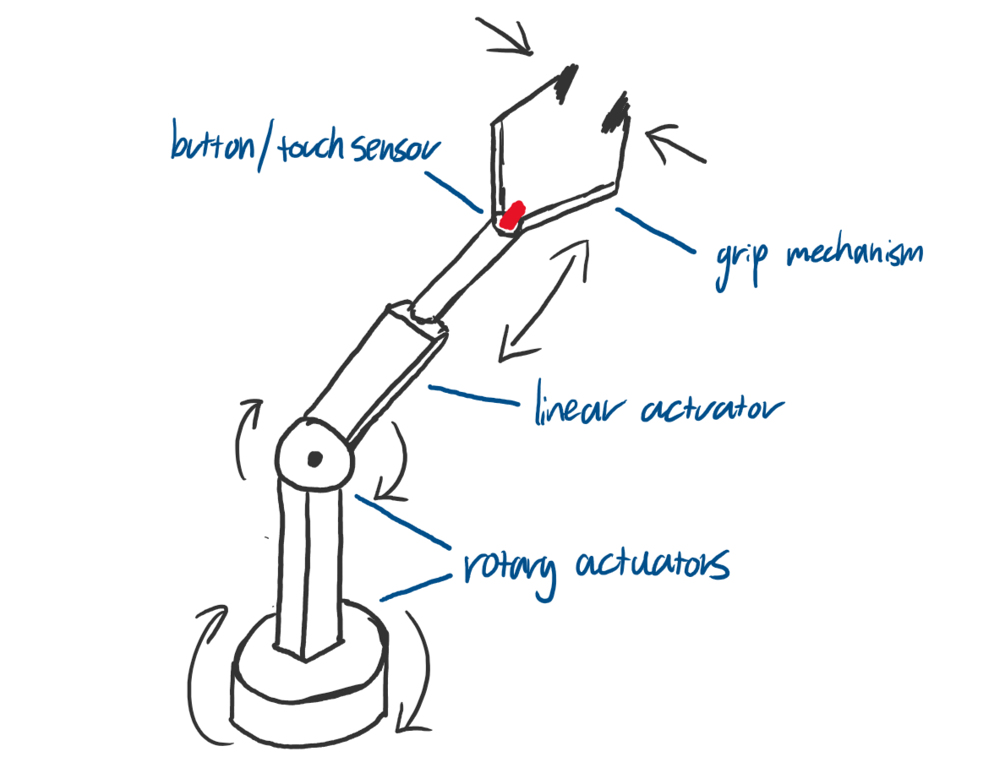
_Sketch of the device in spherical configuration, including the three potential movement axes, and the touch sensor on the grip mechanism._

### Actuation, Sensing & Materials

<strong>Motor & actuator selection</strong>

The DC electric linear actuator was selected over a servo linear actuator, primarily due to its cost-effectiveness, flexibility, and potential stroke length. Torque calculations for the elevational axis (modelled as a class 1 lever in Desmos, using a counterweight to counter gravity) informed the selection of MG996R servo motors for the rotational and elevational axes, providing adequate torque and precision for the lightweight configuration.

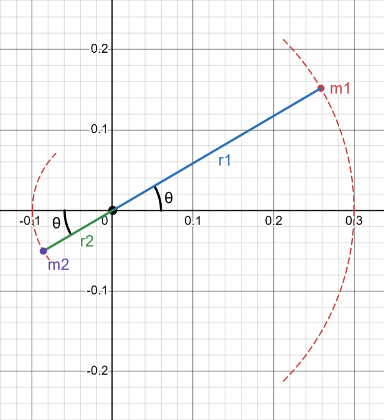
_Mathematical model of the arm as a 1st class lever in Desmos graphing calculator._

<strong>Position determination & sensing</strong>

A single camera and contact sensor setup was selected, rather than a complex stereoscopic system, reducing programming complexity and component cost while offering higher precision through direct physical feedback. The primary contact sensor is a Force-Sensing Resistor (FSR), chosen for its high sensitivity and low actuation force, ideal for detecting contact with a delicate strawberry. To prevent false positives from leaves, this is paired with a colour sensor with a built-in LED, helping to ensure the object is red and ripe before the grip sequence is initiated.

<strong>Materials selection</strong>

| Component            | Options considered              | Decision                                                                                          |
| -------------------- | ------------------------------- | ------------------------------------------------------------------------------------------------- |
| 3D printing filament | PLA vs Carbon Fibre Filament    | **PLA**: cheaper for rapid prototyping and iteration, theoretically sufficient strength           |
| Soft grip material   | TPU flexible filament vs Sponge | **Sponge**: additional precision/durability not required for prototyping, easily cut and replaced |
| Base/frame           | MDF panels vs alternatives      | **MDF**: cheaper and easier to modify for mounting                                                |

<strong>Power & electronics</strong>

A Raspberry Pi 3 performs real-time image analysis from the USB webcam, chosen for being compact and affordable while having sufficient processing power. It sends simple commands to an Arduino Uno R3, which serves as an intermediate controller for electronic components, while also sending FSR sensor and colour sensor data back to the Raspberry Pi. The Arduino was selected for being simple, reliable, and well-documented.

| Component       | Max Current | Voltage | Power |
| --------------- | ----------- | ------- | ----- |
| Colour sensor   | 2mA         | 5V      | 10mW  |
| Linear actuator | 1A          | 12V     | 12W   |
| MG996R (×2)     | 2.5A        | 5V      | 12.5W |
| SG90 (grip)     | 700mA       | 5V      | 3.5W  |
| Arduino Uno R3  | 50mA        | 5V      | 250mW |
| L298N           | 36mA        | 12V     | 432mW |

_Maximum current, nominal voltage, and power draw of all electrical components._

In the worst-case scenario, the device draws a maximum of 41.2W, requiring the 12V power supply to supply at least 3.43A. Applying an industry-standard Factor of Safety of +125%, a requirement of 4.29A for the power supply was determined.

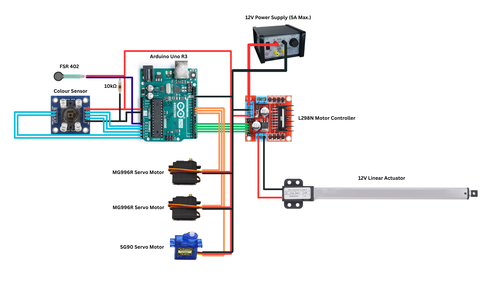
_Figure: Circuit diagram of the AutoBerryPicker system._

### Final Design

The final design of the AutoBerryPicker balances range, flexibility, cost, and complexity. Because a heavy-duty linear actuator for the elevation axis would require torque far exceeding that of any affordable servo motors, I chose a lightweight 12V DC linear actuator for the extension axis. This enabled the use of MG996R servo motors for the rotational and elevational axes. Combined with a dual-sensor system, it formed an effective and affordable solution that met the original constraints.

---

## Planning

Tool and software selections were justified against alternatives:

| Tool / Software                                                     | Alternative(s) considered                   | Why it was chosen                                                                                                                 |
| ------------------------------------------------------------------- | ------------------------------------------- | --------------------------------------------------------------------------------------------------------------------------------- |
| **Onshape** (CAD)                                                   | Autodesk Inventor                           | Cloud-based, automatic saving, allows work at school/home with no file transfer, infinite project history                         |
| **Arduino IDE**                                                     | PlatformIO                                  | Simplicity, wide documentation, built-in example code snippets                                                                    |
| **Python** (OpenCV, NumPy)                                          | C++                                         | Simplicity and library availability: OpenCV for image processing/contour detection, NumPy for maths and GUI display               |
| **VS Code**                                                         | Python IDLE, PyCharm                        | Efficient UX, multi-file project management, excellent debugging features                                                         |
| **3D printer** (Bambu Lab P1S & X1C)                                | CNC milling, manual fabrication             | Custom/complex parts, precise small tolerances, high strength-to-weight ratio, fast printing enabled rapid, iterative prototyping |
| **CNC laser engraver**                                              | 3D printing or ordering a base plate        | High precision on 2D profiles, smoother/more accurate finish, higher speed                                                        |
| **Lego® bricks**                                                    | Cardboard mockups, skipping to CAD          | Rapid, rough prototyping to test the mechanical idea of a polar robotic arm before investing time into CAD                        |
| **Electronics tools** (soldering iron, heat gun, hot melt glue gun) | Solderless breadboards, crimped connections | Reliable, durable electrical connections; reduced risk of failure due to tension on wires                                         |
| **Diagnostic tools** (multimeter, DC power supply)                  | Guesswork, batteries for all testing        | Essential for testing electronic components and finding faults                                                                    |

A detailed work timeline plan, risk assessments, and a Gantt chart were completed to guide the 15-week production schedule.

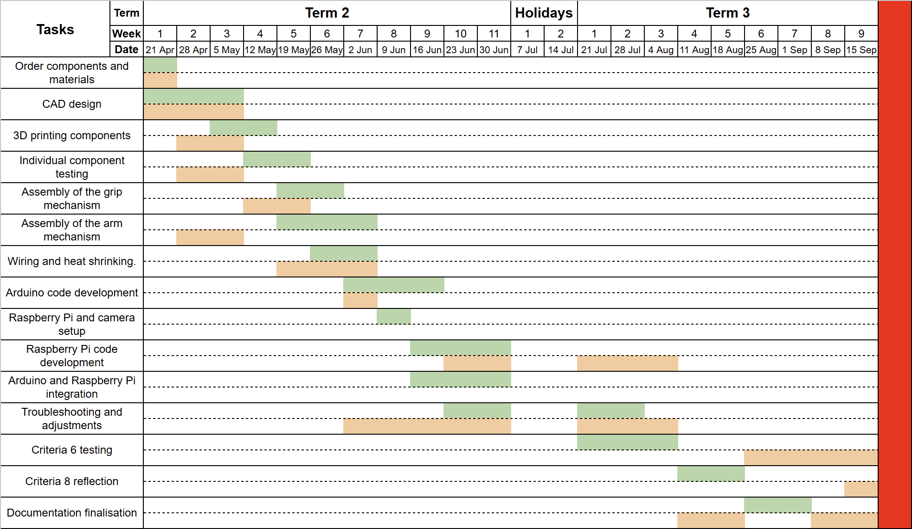
_Planned (green) vs actual (orange) project timeline._

---

## Development Log

I developed the system over 15 weeks, following an iterative process where issues identified at the end of each session were addressed in the next. In Week 1, I built a rapid LEGO® prototype of the mechanical concept (base, rotational and elevational axes, linear axis, and grip mechanism) to gain a practical understanding of possible design challenges before committing to CAD and fabrication.

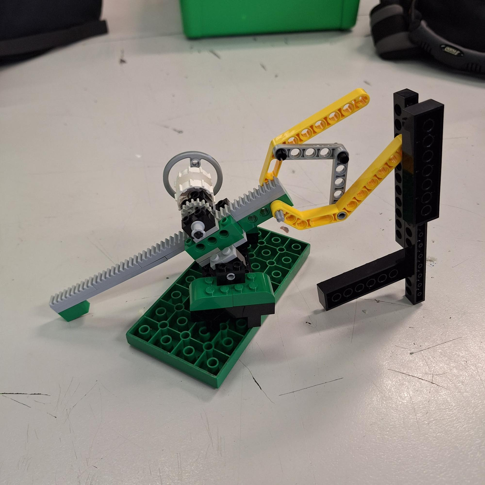
_Early LEGO® prototype used to test the polar robotic arm concept._

The use of 3D printing technology was invaluable, allowing parts to be completely redesigned and reprinted within hours of identifying faults. Extensive daily logs documented the development, which proved useful for retrospectively clarifying past decisions and for evaluating repairability during later diagnostic testing.

> **Notable technical setbacks** encountered and resolved (or documented for future improvement) during the build:
>
> - A thin-walled central vertical shaft that snapped several times during development and was replaced, with friction ultimately proving insufficient to secure it to the rotational motor
> - A grip-mechanism load test in which the gears started to slip, leading to a critical failure and permanent damage to a servo motor from excessive torque load

| Week   | Highlights                                                                                                                                                                                                                                                                                                                                                                                                                                                                                                                                                                     |
| ------ | ------------------------------------------------------------------------------------------------------------------------------------------------------------------------------------------------------------------------------------------------------------------------------------------------------------------------------------------------------------------------------------------------------------------------------------------------------------------------------------------------------------------------------------------------------------------------------ |
| **1**  | Built a basic unpowered LEGO® prototype of the base, rotational and elevational axes, linear axis, and grip mechanism, to gain a practical understanding of possible challenges. Noted significant torque on the arm due to the weight of the grip mechanism and linear actuator, and realised it may be easier to have the entire motor move with the elevation mechanism, using the motor's own weight as a counterweight. Ordered components from Amazon and Core Electronics, sourced others from Viewbank College, and began CAD modelling of the circuit box in Onshape. |
| **2**  | The first iteration of the circuit box base was successful, with all parts and 3D printed standoffs fitting well. Found some flaws in the design and addressed them with hand tools and modifications in CAD. Successfully tested a new variation of the code with a draft polar coordinate system for easier control interfacing.                                                                                                                                                                                                                                             |
| **3**  | The polar coordinate program test was successful, and test fitting gave a good demonstration of the range of the arm and showed the fit was secure. The main components of the arm were assembled without issue, and required components for the grip mechanism were sourced.                                                                                                                                                                                                                                                                                                  |
| **4**  | With the majority of CAD work done, work moved to 3D printing the grip mechanism parts and assembling them. Became slightly behind schedule due to time spent catching up on documentation. Decided to use a pre-made gripper design (credit to Techniccontroller), and added a hole in the grip mechanism for a bolt to secure it to the linear actuator.                                                                                                                                                                                                                     |
| **5**  | With all electrical components in place, work began on finishing the wiring and closing the circuit box. The FSR was found to be functioning correctly. Heat-shrunk cable bundles and did cable management and soldering.                                                                                                                                                                                                                                                                                                                                                      |
| **6**  | Wiring and heat shrinking were completed, and the wiring pins of the motors were verified. Code and testing gave insights into how to program the arm to move, and verified that the motors and actuators in the arm work correctly. The circuit box was closed successfully with no issues, on track to begin software development: manual control first, then automatic optical detection with FSR feedback, before porting to the Raspberry Pi for full autonomy.                                                                                                           |
| **7**  | Testing discovered critical flaws in the design along with hardware faults, including a damaged MG996R servo motor with sheared gears, which was removed for replacement. Redesigned the 3D printed components of the elevational axis to reduce loads and torques, including adding a counterweight, redesigned the actuator mount for improved strength, and redesigned the rotational base to be two-sided with an axle to improve strength and reduce flex.                                                                                                                |
| **8**  | Progress on the new actuator mount and new MG996R motor allowed the elevation axis mechanism to be reassembled and testing resumed. Uncovered several issues with the modifications made to the rotational base and actuator mount, fixed them in CAD, and moved to a third iteration of both parts: filing counterweight pegs, reducing the elevational motor shaft diameter, strengthening axle supports, and adding an M3 bolt to secure the elevational motor. The rotating assembly was reassembled successfully with no apparent issues.                                 |
| **9**  | Filed down the aluminium counterweight to allow it to fit. Completed the main mechanical and electrical components with no serious issues, and testing went well, manually moving the device into various positions and picking up and moving a foam block. Due to time constraints, decided to remove the FSR object-collision-detection feature and instead rely on strawberries being pushed along by the grip mechanism.                                                                                                                                                   |
| **10** | Implemented automated colour masking and boundary boxes for the detection of colours, laying the foundation of the software, and secured the counterweight and camera for more consistent performance. More progress than planned was made on user interface upgrades, and the program draft was ready for testing. Identified an issue with the Python GUI freezing, preventing progress towards automation.                                                                                                                                                                  |
| **11** | A motor controller failure was only a minor setback: the cause of the actuator not moving was quickly identified and a replacement installed. Another minor setback with an unexpected modification was again quickly resolved. Decided to use a PID program as the guidance for the control subsystem, and gained a good grasp of the concept, with the next step being to create the OpenCV colour masking system to determine positional error.                                                                                                                             |
| **12** | Solid progress was made on an HSV Tuner program to find the optimal HSV settings for detecting red objects, which worked without issue and impressively distinguished red objects from the background, though detection failed at some angles when not directly lit. A wrap-around HSV system was trialled but ultimately showed no real improvement, so the design reverted to a simple HSV range, since strawberries are almost axially symmetrical and look similar from all angles.                                                                                        |
| **13** | Created a Red Foam Block to allow testing of the PID system. The main work on the PID code was completed, and a test of the new PID control program was successful, with the arm able to track moving red objects and centre itself on stationary ones. Decided to start with a PD controller first, excluding the Integral term and using only the x-axis, and made GUI updates for adjustable center sliders.                                                                                                                                                                |
| **14** | Added y-axis PID control to allow elevational movement. The new version with all axes implemented worked well and was able to successfully navigate to targets in 3D space, though oscillations were observed in the horizontal (rotational) axis. Testing of different PID settings provided valuable data on effective settings to reduce these oscillations and improve picking efficiency, precision, and accuracy.                                                                                                                                                        |
| **15** | Added a centroid calculation and smoothing filter, using a weighted moving average for the coordinates of objects, for more stable and reliable tracking with less jitter. Added a feature to save and load PID settings via a JSON file system. The final test of the device was completed, and it was decided not to use the Raspberry Pi 3, sticking with the laptop for running code instead due to time constraints, prioritising the functionality of the device.                                                                                                        |

Development Photos

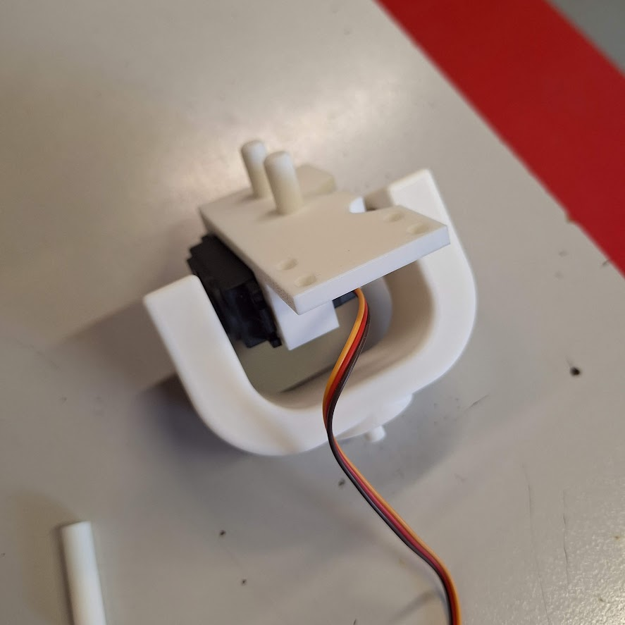
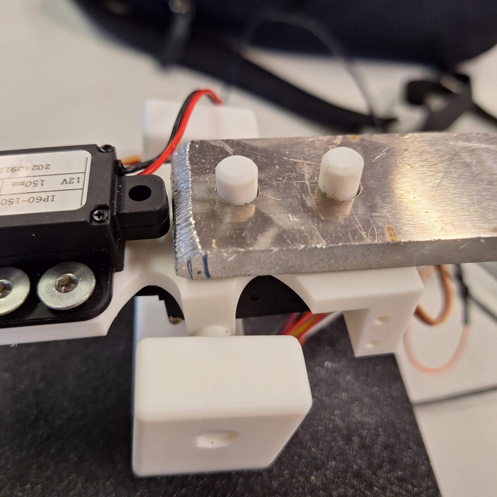
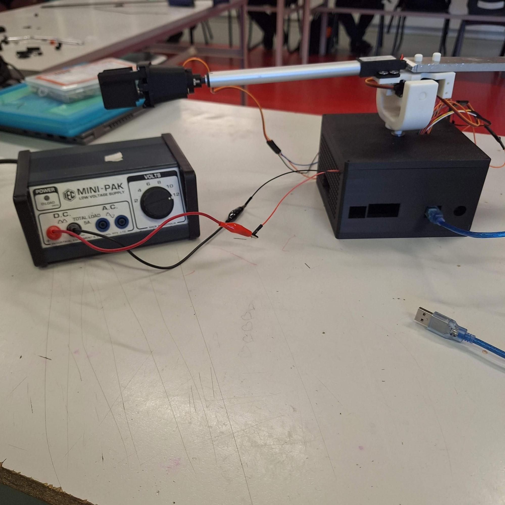
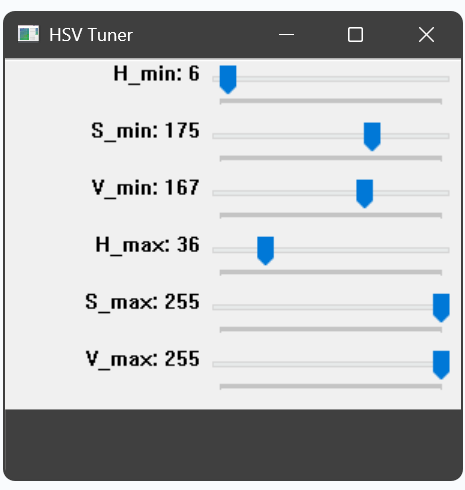
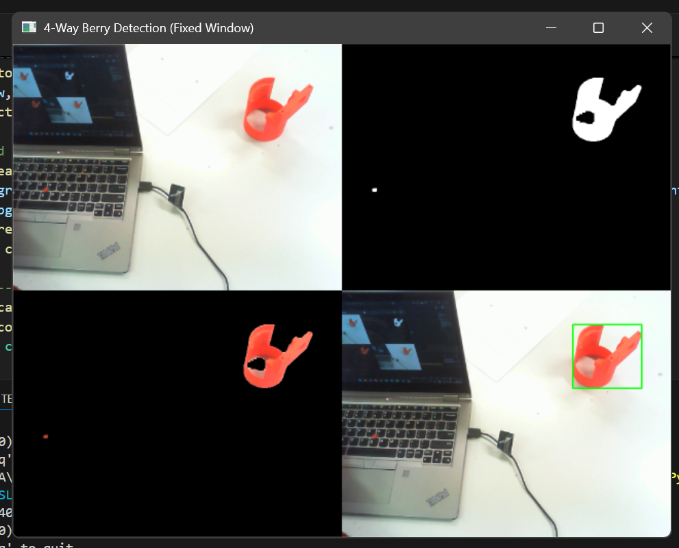

---

## Testing & Results

Ten diagnostic tests were conducted to evaluate the completed device against the design brief.

| #   | Test                            | Aim                                                                              | Result                                                                                                                                                                                                                    |
| --- | ------------------------------- | -------------------------------------------------------------------------------- | ------------------------------------------------------------------------------------------------------------------------------------------------------------------------------------------------------------------------- |
| 1   | Arm Range of Motion             | Determine range of positions the arm can move to in 3D space                     | Rotational axis achieved only 52° (expected 180°, **-71%**), extension axis achieved 150mm (0.0% difference), elevational axis achieved 52° (+3.8%). Likely cause: poor attachment/skipping of the central vertical shaft |
| 2   | Arm Movement Speed              | Determine time to move the arm between positions                                 | Average of **2.07s** across 4 trials (95% CI: 1.94-2.20s), significantly less than the 3-second estimate                                                                                                                  |
| 3   | Torque and Stalls               | Determine if MG996R motors avoid stalling under worst-case loads                 | Grip initially held over 500g, far exceeding expectations, but gears then slipped, causing a critical failure and permanent servo damage; test abandoned for safety and validity                                          |
| 4   | Device Weight                   | Determine full weight excluding power source                                     | **1081.4g** measured vs 976g expected, slightly higher, likely due to unmodelled wiring/bolts and non-uniform PLA wall density                                                                                            |
| 5   | Strawberry Recognition Accuracy | Determine false-positive rate when detecting strawberries among other crop types | **0% false positive rate** across 16 trials. HSV colour masking proved simple and effective                                                                                                                               |
| 6   | 3D Position Accuracy            | Compare software-predicted position vs true position                             | Extension and elevational axes were within ~10% of commanded position (success); rotational axis differed significantly, likely due to gear slippage from an insecure vertical shaft                                      |
| 7   | Strawberry Grip Test            | Evaluate if the grip damages crops and holds them securely                       | No damage sustained to the strawberry, but grip force was weak and holding security was questionable                                                                                                                      |
| 8   | Picking Rate Efficiency         | Assess detection-and-removal rate                                                | **2.1 picks/minute** (142s for 5 objects) vs ~3/minute expected, limited by a damaged elevational motor and weak grip force causing slippage                                                                              |
| 9   | Power Source Compatibility      | Compare performance on 12V battery vs 12V DC supply                              | No statistically significant difference (p = 0.7583); device performance is unaffected by power source type                                                                                                               |
| 10  | Power Consumption               | Determine maximum power draw in operation                                        | **30.5W** peak recorded (avg 28.0W) vs 41.2W theoretical maximum, likely due to the test power supply under-delivering voltage                                                                                            |

Test setup photos

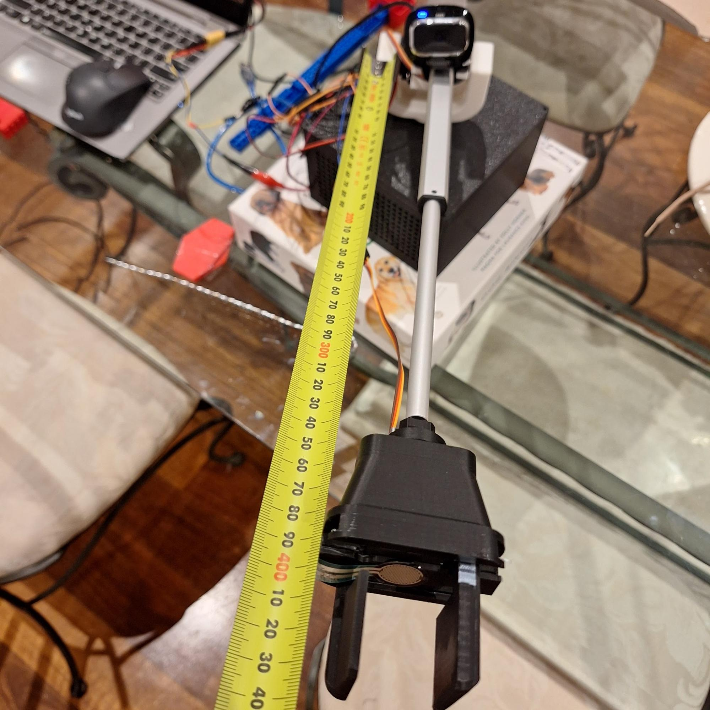
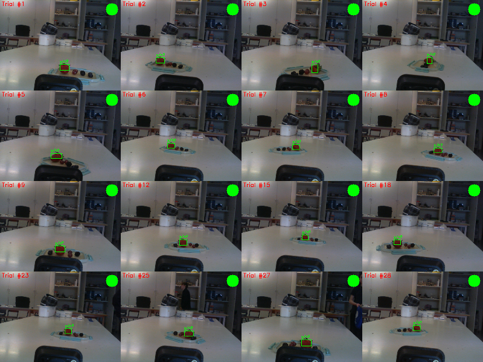
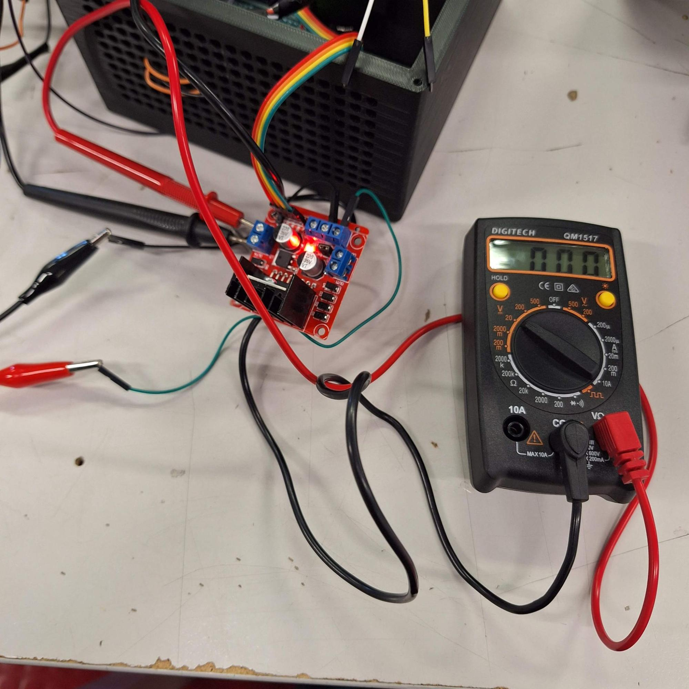

---

## Evaluation & Improvements

### Final Score: 29/40 (73%)

The final score was determined by evaluating 20 criteria on a scale of 0 to 2:

$$\text{Final Score} = \frac{1}{20 \times 2} \times \sum_{n=1}^{20} S(n) \times 100\%$$

### Project Cost

Most components were reused from old projects or supplied by Viewbank College. The total value below assumes an individual starts with no materials and wants to build one from scratch. All prices are the cheapest available at the time of writing.

| Component                               | Cost                              |
| --------------------------------------- | --------------------------------- |
| Bambu Lab PLA Basic filament (0.455 kg) | \$9.10                            |
| 12V Linear actuator (150 mm, 20 N)      | \$36.10                           |
| Bolts and nuts (<40 pcs used)           | \$1.18                            |
| Flanged ball bearings (×2)              | \$6.95                            |
| MG996R servo (×2)                       | \$17.56                           |
| Microsoft Lifecam 3000                  | \$39.95                           |
| Arduino Uno R3                          | \$19.99                           |
| L298N motor controller                  | \$8.95                            |
| SG90 micro servo                        | \$4.28                            |
| Aluminium counterweight                 | \$5.04                            |
| Jumper wires (<40 pcs)                  | \$7.27                            |
| Heat shrink tubing (<10 pcs)            | \$0.14                            |
| Arduino-compatible colour sensor        | N/A                               |
| Interlink FSR 402                       | N/A                               |
| Raspberry Pi 3                          | N/A                               |
| DPDT Latching Toggle Switch             | N/A                               |
| 3 mm plywood board                      | N/A                               |
| Sponge (for grip padding)               | N/A                               |
| **Total**                               | **\$156.51** _(vs. \$150 target)_ |

_Components marked N/A were sourced from school inventory or personal stock at no cost to the project budget._

During planning, overarching details such as torque calculations, power calculations, and arm types were extensively investigated and mathematically modelled. However, some details, such as CAD designs and code logic, were not finalised until production, and prototyping occurred later than ideal in the first week of production rather than during Criteria 2 decision-making. Several feature compromises were also made to meet the timeline, including the omission of the colour sensor and FSR position-determination systems, and the omission of the Raspberry Pi 3 (with reliance on a laptop for the Python program instead).

**What Went Well**

- The production stages were well-documented and executed, and the iterative development process, facilitated by 3D printing, was invaluable, allowing issues identified at the end of each session to be addressed in later logs
- The diagnostic testing and evaluation was successful overall, and gave a clear picture of device performance against the design brief
- With a final score of 73%, the system was ultimately successful in meeting the majority of the evaluation criteria from the design brief, resulting in an autonomous system able to grab and move strawberries

**What Could Be Improved**

- A major flaw identified was the slow speed of the device due to actuator and PID control limitations, which severely limits commercial viability for farm use, hindering the device's support of SDG 8
- The grip mechanism was not very effective at handling the variety of strawberry sizes, as it moves paddles by a fixed amount, squishing larger berries and failing to secure smaller ones
- Feature compromises (omitted colour sensor, FSR positioning, and Raspberry Pi 3) reduced the system's fidelity to the original design brief

> This indicated that the initial goals for the device's performance, including its considerations and constraints, may have been too ambitious. Still, working through those problems taught a lot over the course of the project.

### Recommendations for Improvement

<strong>Planning recommendations</strong>

1. Allocate more time to researching how to program the device, including pseudocode of the full device and specific software requirements
2. Research safety requirements to protect the device (not just the user), reducing the risk of catastrophic failures such as the 2 occasions of motors being destroyed by excessive torque loads
3. Complete physical prototypes earlier in planning to inform component and design selection
4. Fully complete design finalisation, including CAD modelling, in the planning stage

<strong>Design recommendations</strong>

1. Change from a polar robotic arm to an **articulated robotic arm** to improve load handling, range of motion, and versatility
2. Replace the single optical sensor with a **3D detection system** such as a stereoscopic camera set, to improve accuracy and facilitate inverse kinematics
3. Redesign the grip mechanism: either a deformable, compliant grip, or a rigid design with force sensors on each paddle
4. Implement a **dedicated power connector** (e.g. barrel jack DC connector) for easier, more commercially viable power sourcing
5. Reduce perforations in the circuit box to better handle humidity, dust, and rain in outdoor farmland
6. Rework code to handle **multiple strawberries** in the camera frame simultaneously

---

## Reflection

The AutoBerryPicker set out to show that an affordable, single-developer robotic system could offer a viable path toward reducing reliance on child and forced labour in agriculture. The final device, a polar-configuration robotic arm using a single camera, contact sensing, and servo/linear-actuator control, picked strawberries autonomously, achieved a 0% false-positive detection rate, and operated reliably across different 12V power sources.

At the same time, the project surfaced clear engineering trade-offs. Mechanical failure points such as the vertical shaft attachment limited range of motion and repeatability, and actuator speed constrained picking rate well below commercial viability. These findings, together with the recommendations above, point to a concrete path for the next iteration, from an articulated arm and 3D sensing to a force-adaptive grip, and are probably the most useful outcome of the project: a set of evidence-based lessons for future development.

---

## Gallery

Gallery GIFs

---

## Documentation

The complete Systems Engineering folio (Criteria 1-8), including full risk assessments, the detailed 15-week development log, complete testing methodology, and reference list, is available in two parts:
- [Criteria 1-4](docs/AutoBerryPicker_Folio_Criteria_1-4.pdf)
- [Criteria 5-8](docs/AutoBerryPicker_Folio_Criteria_5-8.pdf)

---

## Acknowledgements & License

<strong>Acknowledgements</strong>

I would like to thank my Systems Engineering Units 1&2 teacher Veena Nair, and my Systems Engineering Units 3&4 teacher Luke Power-Virant, for their continual support and guidance throughout the development of the AutoBerryPicker and my Systems Engineering education at Viewbank College.

I would also like to acknowledge Edgar Welte, M. Sc., a PhD student in Robotics and Artificial Intelligence at the Karlsruhe Institute of Technology (KIT), for sharing the CAD design of the parallel gripper mechanism under the username Techniccontroller.

Furthermore, I would like to acknowledge David Payne from Banyule Nillumbik Tech School for his support in manufacturing the aluminium components using a waterjet cutter in 2024, as part of my previous year's folio, which were repurposed and incorporated into this project as counterweights.

I also acknowledge the support of Viewbank College's IT technicians Hai Yan and Danny Nguyen, whose assistance was crucial for setting up and maintaining the 3D printers in the J07 engineering workshop room.

## License

This project is licensed under the MIT License. See the [LICENSE](LICENSE) file for details.

---

Completed as part of the VCAA Systems Engineering study design at Viewbank College.

