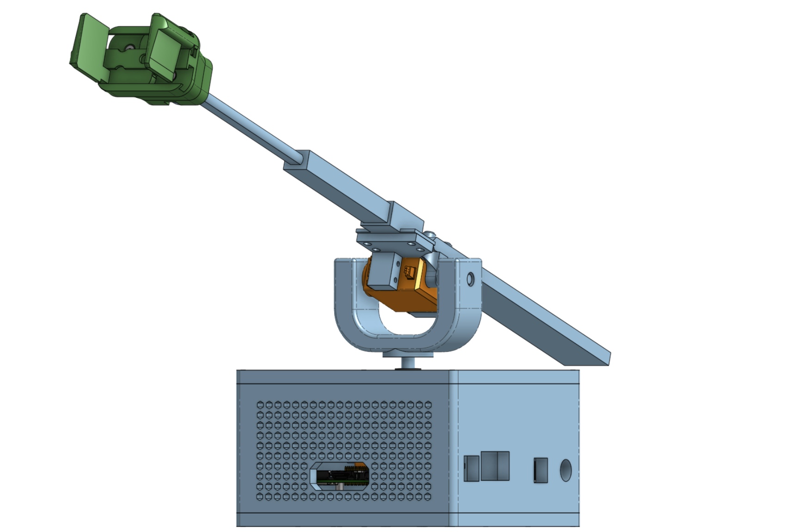
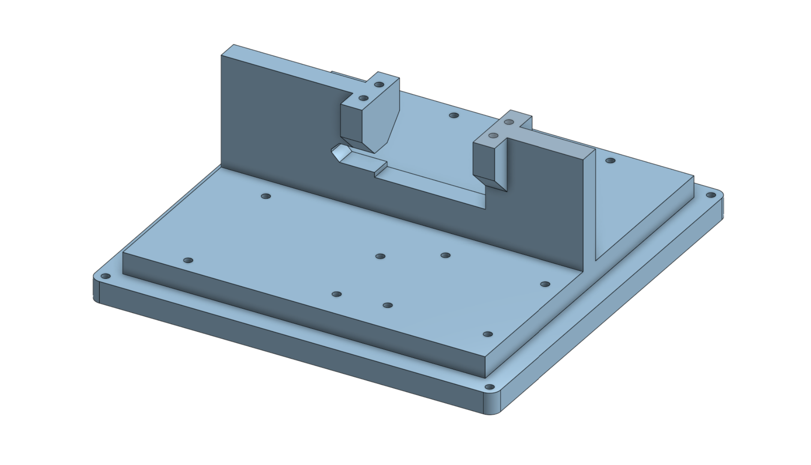
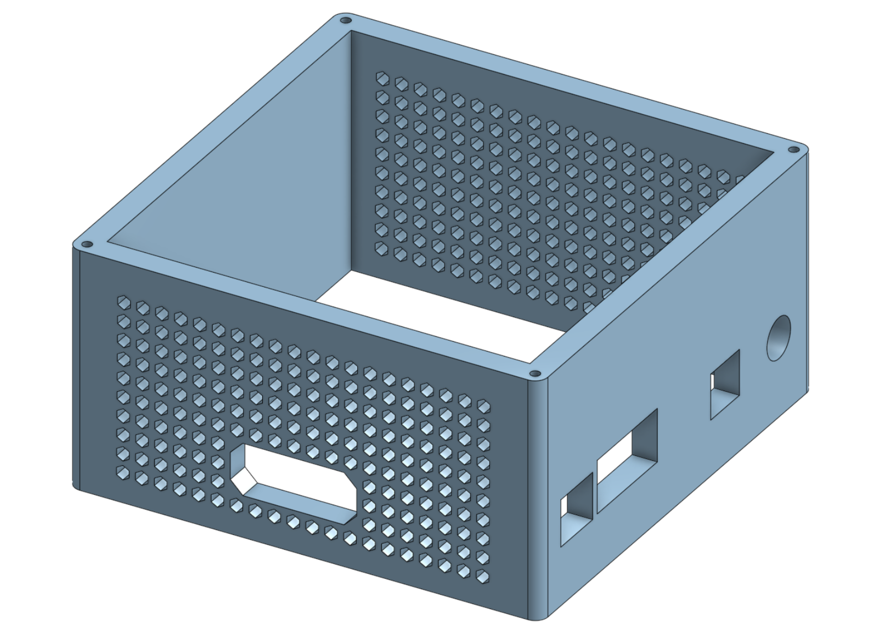
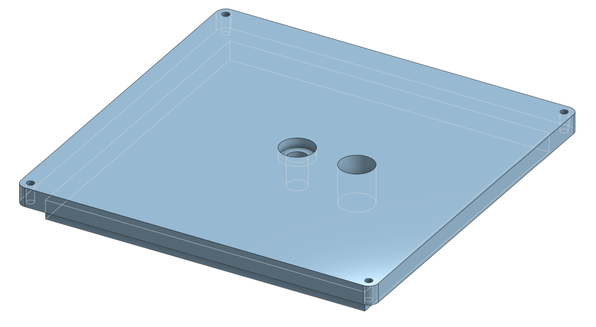
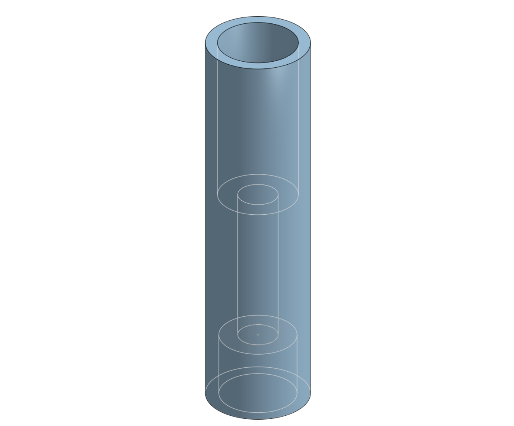
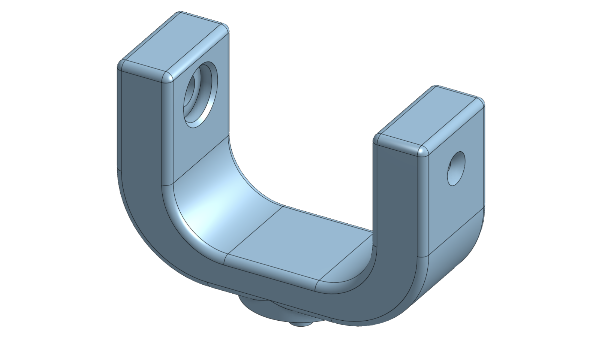
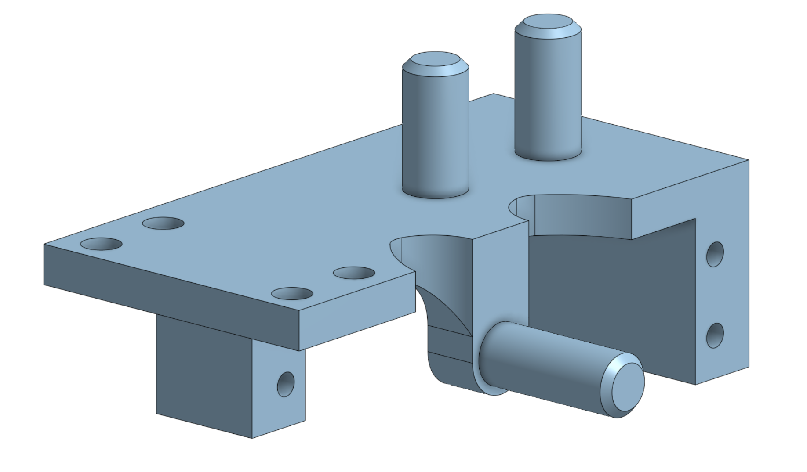
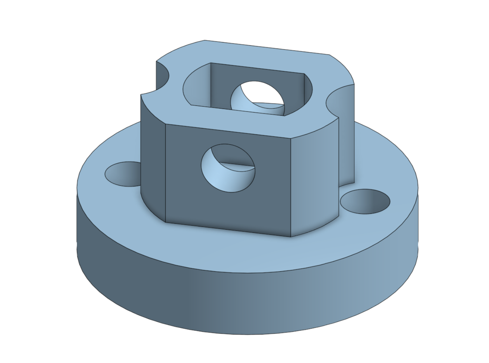
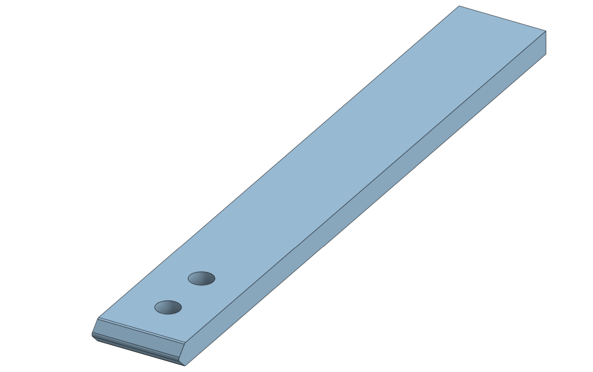

# AutoBerryPicker CAD Files

**3D models and manufacturing files for the electromechanical components of the AutoBerryPicker system.**

  

---

## Full Assembly

### [`autoberrypicker-full-assembly.step`](models/autoberrypicker-full-assembly.step)

_The complete AutoBerryPicker CAD assembly._

#### Explanation

The final design choice for the AutoBerryPicker is a result of a series of separate investigations and small choices, where each component choice was made to create a system that addresses the constraints of the design brief. This combination of a polar arm, lightweight actuators, servo control, and a dual-sensor system creates an integrated solution to the problem of picking berries autonomously.

#### Materials & Processes

The internal and external components of the system must all be easily accessible and replaceable without requiring any specialised tools or equipment. This improves the ease of maintenance and repair of the device and allows the user to replace damaged components.

---

## Circuit Enclosure

### [`circuit-box-base.step`](models/circuit-box-base.step)

_The base plate and mounting surface for the microcontrollers._

#### Explanation

This is the base of the circuit components box, where the Arduino, L298N, and Raspberry Pi will be mounted. This will ensure that the wiring between the various components stays intact, preventing any movement of components which could lead to shorted or broken circuits. Added barriers have been put in place to separate the 3 main microcontrollers. There is a slot in the base which tightly fits the motor, and includes four screw holes for secure mounting of the motor.

#### Modifications

I noticed that the barrier between the L298N and Arduino was in the way of wiring, and made it very difficult to plug things into the L298N. I decided to remove this wall by snapping it off. I also adjusted the 3D model in Onshape so that if I print a second version the flaw is addressed appropriately.

#### Materials & Processes

Due to the large size of the base, it was printed with 0.20mm layer height and utilised 6 wall layers for additional strength.

---

### [`circuit-box-walls.step`](models/circuit-box-walls.step)

_The ventilated walls of the circuitry enclosure._

#### Explanation

These are the walls of the circuitry box, which surround the wiring to prevent any broken or short circuits due to collisions or movement. They are designed to fit tightly on top of the base, and are 8mm thick to ensure long-term durability and resistance to external conditions. The hexagonal grille on two of the faces of the box serves two purposes; the first is to provide ventilation and reduce the risk of overheating due to the heat radiated by parts within the box. The second purpose of the grille is to allow the lights inside the box, including the Arduino Uno R3 and L298N power indicator lights, to be visible. I also included the addition of holes for wiring, including slots for USB cables and ethernet for the Raspberry Pi, and slots for power and a serial cable for the Arduino.

#### Modifications

When attempting to fit the circuit enclose walls, I encountered two main issues. The first main issue was that the slot for the HDMI cable became obstructed, which may hinder code development if I need a display output from the Raspberry Pi 3. The second issue was that the walls simply did not fit, as a plastic protrusion from the Raspberry Pi 3 (adjacent to the HDMI port) physically stopped the walls from slotting into the correct position.

I modified the Onshape CAD model with the issue addressed by creating a new hole in the side of the walls. I also cut a slot in the circuit box walls to allow for a Micro USB cable to be fed through for Raspberry Pi 3 power.

---

### [`circuit-box-lid.step`](models/circuit-box-lid.step)

_The lid of the circuit box, featuring the primary bearing indent._

#### Explanation

This is the lid of the circuit box, which is also 8mm thick and tightly slots on top of the walls. There is an indent that is designed to tightly fit the 14mm outer diameter ball bearing, providing more stability to the vertical shaft of the device by restricting sideways movement.

#### Modifications

I drilled a hole to allow for the routing of wiring from the elevational motor, linear actuator, and grip subsystem, as I neglected this in the original design. I also adjusted this in the CAD model on Onshape, except instead I added a larger, 14mm hole to provide additional space and mitigate risk of pinched wires and damage.

---

## Robotic Arm Subsystem

### [`vertical-shaft.step`](models/vertical-shaft.step)

_The primary drive shaft connecting the base motor to the rotational assembly._

#### Explanation

The shaft has an 8mm outer diameter to tightly fit the slot in the lid of the circuit box, and matches the diameter of the flanged bearing to ensure reduced friction and support from sideways loads. The shaft has a 5.8mm inner diameter to allow it to very tightly fit the pin for the rotational base and the MG996R motor spline. Furthermore, it has an M3-sized opening to allow it to be secured to the rotational motor if required.

#### Modifications

When moving the device back to a safe storage place, I accidentally knocked the mechanism on something, resulting in the 3D printed vertical shaft snapping. To fix this, I just printed another vertical shaft, as it was an issue with improper handling rather than a design issue.

The vertical shaft was thin-walled and broke several times during development; it may be a critical failure point. Furthermore, the attempt to use friction to secure the vertical shaft to the rotational motor may have been insufficient. The original plan was to use a bolt, however this was substituted as the bolt often failed to thread properly, and also made the device difficult to disassemble for maintenance. As a future improvement, a thicker and bolt-secured vertical shaft should be explored.

---

### [`rotational-base.step`](models/rotational-base.step)

_The two-sided rotational base component._

#### Explanation

This is the redesigned rotational base component. Instead of an asymmetrical design, I have switched to a symmetrical design. A 14mm hole is included for adding a flanged bearing to insert the axle I added on the linear actuator mount, reducing friction and improving the longevity and efficiency of the design.

#### Modifications

I redesigned the rotational base to be two-sided with an axle, to improve strength and reduce flex. Compared to the tight fit of the motor horn, the slot for the motor shaft in the rotational base part was far looser, preventing the motor from being able to produce any torque, as it would just slip in the slot.

To address this, I edited the CAD model in Onshape, reducing the diameter of the slot for the motor shaft from 6.0mm to 5.7mm, which should result in a tighter fit. I also added an M3 bolt to secure the elevational axis motor to the rotational base.

---

### [`linear-actuator-mount.step`](models/linear-actuator-mount.step)

_The mount connecting the linear actuator and counterweight to the elevational axis._

#### Explanation

This is the redesigned actuator mount. The first change to the design is an additional axle, so that the elevating components are supported symmetrically rather than just by the shaft of the motor. This reduces the radial load on the elevational axis motor. The second main change was the addition of two pegs, which allow metal counterweights to be attached. These counterweights create an opposing moment to the one generated by the linear actuator and grip mechanism, reducing the torque required to maintain equilibrium.

#### Modifications

After attempting to install the linear actuator mount onto the elevational servo motor, I realised that I didn’t consider adding a slot for the routing of wiring, so it didn’t fit. To fix this, I decided to remove a section of the part to allow it to fit.

The measurements for the diameter of the pegs were off by about 1mm, resulting in a peg that was too large to fit the holes in the aluminium. I used a rasp to remove PLA material from the pegs to reduce their diameter and improve the fit. I also edited the CAD model in Onshape, reducing the diameter from 8.7mm to 7.8mm for ease of manufacture if the part is to be re-printed.

The axle of the actuator mount originally snapped off the rest of the part. To address this structural integrity issue I will both increase the infill and wall loop count in print settings. I also edited the CAD model in Onshape, adding some fillets and chamfers to reduce the risk of snapping by reducing the number of right angles in the part.

#### Materials & Processes

The automatic support generation in the slicer placed supports in M3 screw holes, which were very difficult to remove from the part. Thus, I will instead use manually placed supports if I print the part again.

---

### [`grip-mechanism-mount.step`](models/grip-mechanism-mount.step)

_The structural mount for the micro servo parallel gripper._

#### Explanation

This is the design for the mount of the grip mechanism. It is designed to allow the grip mechanism to be mounted to the arm using two M3 bolts.

#### Modifications

After assembling the components of the grip mechanism, I realised that I hadn’t added a hole to secure the grip mechanism to the linear actuator. Without this, the grip would not be securely attached, so I modified the CAD model to add a 4mm hole.

---

### [`aluminium-counterweight.step`](models/aluminium-counterweight.step)

_The machined aluminium plate used to counter-balance the linear actuator._

#### Explanation

This is an 8mm deep, 30mm wide aluminium plate. I plan to use this as a counterweight to reduce the required torque to maintain equilibrium for the device, reducing the risk of any damage to the servo motor and shearing of gears.

#### Modifications

After trying to put the counterweight onto the pegs, I noticed it wouldn’t fit, despite the pegs being a perfect match for the diameter of the holes in the aluminium this time. The reason it didn’t fit was that the counterweight slightly protruded past the linear actuator, so it would collide with the actuator and prevent proper insertion. To fix this, I used a rasp to shave away material from the aluminium plate, reducing its length slightly so that it was able to fit without any collision.
